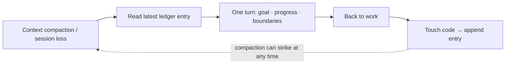
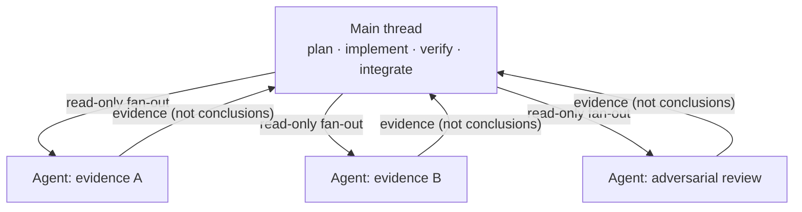

# ⚒️ Forged in Production

**An engineering playbook for long-running AI collaboration — every rule here traces back to a real incident**

[中文](README.md) | **English**


> Most "AI coding best practices" out there were designed at a whiteboard.
>
> This one was **forged**: it comes from a production system with real paying users and real money flowing through it, hammered out over months of deep collaboration with AI agents — paid for in rework, outages, and actual cash.
>
> **Every rule in this repo points to a specific crash. The ones that couldn't have already been deleted.**

---

## Six walls you have probably hit

If you've let an AI agent (Claude Code / Codex / Cursor / …) work deeply on a **real project** — not a demo — you have run into some of these:

| | Symptom |
|---|---|
| 🧠 **Amnesia** | Context gets compacted; the AI spends half an hour "re-familiarizing itself with the project," re-investigating conclusions that were verified yesterday |
| 🗿 **Lost decisions** | Nobody can explain why option A was chosen over B three weeks ago; you dig through chat logs until you question your life choices |
| ✅ **False green lights** | The AI reports "all tests pass" — they never ran, or they exercised something other than the target scenario |
| 🔁 **The recurring pit** | The same trap, once a month, wearing a different costume |
| 💥 **Mutual trampling** | Multiple agents editing in parallel overwrite each other; a `git add -A` sweeps someone else's half-finished work into history |
| 🏗️ **Over-engineering** | A one-sentence request comes back as a "platform" with its own page, five config options, and three layers of abstraction |

Six walls, six patterns. **Each pattern opens with the incident, then states the rules** — because in the other order, you wouldn't believe it.

---

## Pattern 1: The Single Task Ledger — record only two things

### The incident

After a context compaction mid-task, the AI treated a conclusion that had been verified against production data the day before as an open question, and re-investigated it from scratch. What burned wasn't tokens — it was an entire afternoon. The worse variant: it re-derived a **different** conclusion, and "fixed" something that had already been fixed.

### The rules

Keep **exactly one task ledger** in the project (a single `WORKLOG.md`). At its core it records only two things:

1. **The goal** — what this stretch of work must ultimately deliver
2. **Where things stand** — including **verification evidence** (what command ran, what output appeared) and **the next step**

Supporting discipline:

- **Touch code → write an entry.** No code touched, no entry — the ledger is not a diary
- After compaction or session loss, recover the goal, progress, and boundaries from the latest entry **within one turn** and get back to work; **do not re-verify established facts, do not re-read old material**
- No parallel ledgers. The day a second "progress doc" appears is the day neither can be trusted



### Why it works

The ledger isn't written for an auditor — it's written **for the next amnesiac version of yourself**. There is exactly one quality bar for an entry: could an agent with zero context pick up the work from this entry alone? The "verification evidence" field is the soul of it — without evidence, the word "done" carries no information (see Pattern 4).

📄 Template: [templates/worklog-template.md](templates/worklog-template.md) *(templates are currently in Chinese — English PRs welcome)*

---

## Pattern 2: Chain Docs — one line per decision

### The incident

A long-running workstream spanning a dozen tasks reached a point where we needed to confirm *why option B was abandoned back then*. The answer was scattered across chat logs from three weeks earlier, a commit message, and a context window that no longer existed. Recovering the answer cost more than re-making the decision — so the decision got re-made. **Backwards.**

### The rules

Every **long-running, cross-task workstream** gets one "chain doc" with three fixed sections:

1. **Current stance** — the conclusions, boundaries, and constraints in force *right now* (always current; rewrite in place when superseded)
2. **Decision chain** — one line per task: date, what was decided, why. **Append-only**
3. **Open items** — hanging questions, each with "who / what condition unblocks it"

Supporting discipline:

- Before touching anything in a workstream's territory, **read its chain doc first** and check for conflicts
- When the stance changes, do both moves **in the same task**: rewrite "current stance" + append one decision-chain line
- Detailed evidence stays in the task ledger; the chain doc **holds only the stance** — it is an index and a verdict, not a warehouse

### Why it works

The ledger flows with time; chain docs settle by topic. The division of labor is crisp: "what happened last week" → ledger; "what is this workstream's current stance and how did it get here" → chain doc. The one-line-per-decision constraint is the point — anything that doesn't fit in one line never belonged here.

📄 Template: [templates/chain-doc-template.md](templates/chain-doc-template.md)

---

## Pattern 3: Memory = Root Cause + Trap + Lever

### The incident

The same class of customer complaint came in a second time. The first investigation took an afternoon and three wrong turns; the second, following the playbook distilled from the first, **located the same root cause in five minutes**. The AI didn't get smarter. The first lesson had been compressed into three lines of "symptom → diagnosis → action" instead of a retrospective essay.

### The rules

Organize cross-session memory as "**one memory = one file = one fact**," with a one-line hook per entry in the index. The core is the **writing formula**:

> **A qualified memory = root cause + trap + lever**

- **Root cause**: the diagnostic formula or the conclusion itself (e.g. "hit rate = cache reads / (input + cache reads), not cache reads / input")
- **Trap**: the wrong turn that wasted time this round, to be avoided next time (e.g. "service X logs in CEST, not UTC — naive timeline matching is off by two hours")
- **Lever**: the **fastest entry point** next time this class of problem appears (e.g. "check column Z of table Y first; it splits three root causes in five minutes")

Anti-patterns, side by side:

| ❌ Don't record | ✅ Record |
|---|---|
| "Fixed the cache hit-rate issue" (git already knows) | "The correct hit-rate formula is X; computing Y instead inflates it by 5 points" |
| "Long investigation, finally resolved" | "For this symptom check A then B; the third possibility is C" |
| "Feature is live" | "The only rollback switch is X; config change takes effect without restart" |
| The full retrospective | A three-line playbook: symptom → diagnosis → action |

### Why it works

A memory's reader is "some future session arriving with the same class of problem," and it has a few seconds to decide whether the memory is useful — so the value must be compressed into the title line. Writing incident investigations directly as playbooks is the **highest-compounding habit** in this entire system: the first afternoon buys every subsequent five minutes.

📄 Template: [templates/memory-template.md](templates/memory-template.md)

---

## Pattern 4: The Risk-Tiered Verification Ladder — "it compiles" ≠ "it's accepted"

### The incident

Incident one: a billing-path fix. Type checks green, unit tests green, merged. The first real request revealed that **the target branch had never been executed** — every green light was illuminating the road next to the one that mattered.

Incident two: a subagent reported "all tests pass." A manual re-run showed the tests did pass — because they ran against **stale code in a different directory**.

### The rules

Verification depth is set by **risk tier**, not by mood:

| Tier | Typical change | Minimum verification |
|---|---|---|
| 🟢 Low | Copy, styling, pure display | Static checks + types/build + smoke test at the change site |
| 🟡 Medium | Business logic, APIs, feature flags | Unit/integration tests **+ actually triggering the target path in an isolated running instance** + both flag states (on/off) pass |
| 🔴 High | Money, permissions, migrations, production cutover | Everything in Medium **+ item-by-item proof for amounts, idempotency, permissions, migration, compensation, rollback** + acceptance in an equivalent environment |

Three iron laws:

1. **Compiling or passing unit tests ≠ target-scenario acceptance.** A green light only proves the spot you illuminated is fine — not that you illuminated the right spot
2. **Never trust an agent's self-reported green.** Acceptance happens on the main thread, or is independently re-run by it; evidence (command + key output) goes into the ledger
3. **For high-risk work, the rollback plan exists before the launch plan.** If you can't state the rollback, you're not ready to ship

### Why it works

There is no reliable correlation between the confidence of an AI's success report and the probability of actual success — it isn't lying; its definition of "passed" is routinely different from yours ("ran" ≠ "ran in the right directory"; "passed" ≠ "exercised the target path"). The ladder turns "how much verification is enough" from a per-occasion argument into a table lookup.

📄 Template: [templates/verification-ladder.md](templates/verification-ladder.md)

---

## Pattern 5: Multi-Agent Discipline — parallelize investigation, not implementation

### The incident

Incident one: two agents editing the same working tree in parallel — A's self-tests were distorted by B's half-finished changes, and B's `git add -A` committed A's unfinished work into history.

Incident two: a dozen concurrent agent threads drove a 20-core / 32 GB workstation to a **hard freeze**. On reboot, the orchestrator auto-restored the threads and froze it again.

Incident three: the same model was fanned out three ways for "independent cross-validation" — and returned three differently-worded copies of **the same bias**. Majority voting handed the wrong answer *more* confidence.

### The rules

- **Parallelize investigation, not implementation.** Evidence gathering, inventories, and cross-checks fan out safely to read-only agents; **code is written on the main thread**, or by at most one writer
- **If you must parallelize writes, isolate physically.** One worktree per subtask, cherry-pick to merge; subtasks that must touch the same files run **sequentially** in one tree
- **Never `git add -A` / `git add .` on a shared tree.** Commit only this round's target files with `git commit --only -- <exact files>`, then verify with `git show --stat` that nothing foreign slipped in
- **Same model × N paths ≈ an echo chamber.** The value of multiple agents is not voting but **adjudicating on evidence** — give each path a different evidence slice and lens, and let the main thread read the evidence and rule, rather than counting ballots
- **Concurrency needs a master valve.** Resource ceilings (threads, memory) are explicit configuration, not "it'll probably be fine"
- **Some code you shouldn't touch even as the main thread.** If it lives in a tree another agent is actively editing *and* it's a sensitive gate (money, migrations, permissions), hand the precise implementation spec to whoever owns that area and let them run their own verification loop — parallel edits collide on the shared tree and skip the checks they owe. What you delegate is the *execution* of the judgment, not the judgment



### Why it works

Investigation is idempotent and side-effect-free — naturally parallel. Implementation is stateful and order-dependent — the coordination cost of parallelizing it exceeds the payoff. "Never trust self-reported green" (Pattern 4) and "implementation stays home" are two faces of the same coin: **you can outsource labor; you cannot outsource judgment.**

---

## Pattern 6: Anti-Over-Engineering as Hard Law

### The incident

A request at the level of "add a button to the existing page" came back as: a standalone routed page, four hot-config options, a speculative abstraction layer, all shipped **default-off**, "awaiting future configuration." It looked more "complete." In reality it converted a one-time decision cost into a permanent maintenance cost — those four config options were never changed once between launch and their eventual deletion.

### The rules

Promote anti-over-engineering from *taste* to a **hard boundary**, written into the rules file the agent reads every single session:

- Ship the **smallest closed loop** that meets the requirement: prefer in-place actions, on-by-default, reusing existing mechanisms and pages
- No standalone pages, parallel infrastructure, or speculative abstractions for small features
- **Look for the existing mechanism before building one.** Before adding a new gate/rule/special-case, grep the codebase for a built-in that already handles this class of problem — **the best optimization is often discovering the wheel already exists**, and using it beats a second wheel (especially: don't bolt special-case logic onto a sensitive gate)
- **No reserving** "might need it later" flags, fields, endpoints, or table columns
- Minimize the configurable surface: only values that business/ops genuinely need to change become config; everything else is a constant
- **The output of a simplification task must itself be simple** — a three-page document arguing how to delete code is performance art

### Why it works

AI is structurally biased toward over-engineering, because "more complete" looks safer from where it stands — every extra config option and abstraction layer feels like a favor to you. Taste does not withstand this bias. Only a hard rule, present in context at the start of every session, does.

---

## The meta-lesson: this system has cut itself twice

Honesty section. This system over-engineered itself too, and the amputations produced rules of their own:

**First cut:** a "dual-model cross-review" hook once sat on the critical path of every commit. Sounds robust; in practice it was a flat tax on every commit, and the vast majority of commits deserved no second model. It was demoted to opt-in — only repos that explicitly ask for it get it.

**Second cut:** a 30+ agent orchestration workflow was once dispatched to answer the question "is our process too complex?" Yes — answering "is this too complex" in the most complex way available. It was stopped mid-flight and replaced with reading three small files and returning a one-page verdict.

Hence the **Rules of Rules** — the meta-rules of this entire repo:

> 1. **Only write rules whose violation hurts.** Every rule must point to a real incident; if it can't, delete it
> 2. **Process weight follows risk, not ceremony.** Tasks that touch money or production carry heavy process; copy changes don't
> 3. **Every rule has exactly one source of truth.** Everywhere else references it, never copies it — copied rules are guaranteed to rot
> 4. **The system must be able to cut itself.** Every layer of process it grows is guilty until it proves it once blocked an incident

---

## Quick start

Want it running now without reading the whole thing? One command installs the
whole thing (rule + hook + ledger + decision surfacing) — idempotent, and it never
overwrites your existing config:

```sh
curl -fsSL https://raw.githubusercontent.com/SPHINX998/forged-in-prod/main/starter/install.sh | sh    # Mac/Linux/WSL/Git-Bash
```
```powershell
iwr -useb https://raw.githubusercontent.com/SPHINX998/forged-in-prod/main/starter/install.ps1 | iex   # Windows PowerShell
```

Details, manual install, and uninstall are in [`starter/`](starter/). **This is the
real answer to "how does the worklog auto-generate"** — not magic, but "resident
rule + backstop hook + read-back on recovery."

## Gradual adoption path

Don't adopt all of it at once. This system grew; yours should too:

| Moment | Move |
|---|---|
| **Day 1** | Just the task ledger: one markdown file, two fields (goal / progress + evidence) |
| **First trap you fall into** | Write your first playbook memory: root cause + trap + lever, three lines |
| **First cross-task workstream** | Open your first chain doc: current stance / decision chain / open items |
| **First multi-agent fan-out** | Implementation stays on the main thread; fan-out is investigation-only; parallel writes get isolated worktrees |
| **First time touching money/production** | Apply the 🔴 tier of the verification ladder; rollback plan before launch plan |

---

## FAQ

**Q: Isn't this just "write good docs"?**
No. Different audience. Documentation is written for human newcomers; this is written for **the next amnesiac AI**. Hence the extreme compression (one-line hooks, three-line playbooks), the fixed entry points (latest ledger entry, three-section chain doc, memory index), and the assumption that the reader must recover full context within a single turn. Human docs have none of these constraints — which is why they never grow into this shape.

**Q: Which tools does this apply to?**
Tool-agnostic. Claude Code, Codex, Cursor, Aider — any agent that can read and write files. The whole system is markdown + discipline. Zero dependencies.

**Q: Isn't this heavy?**
See Rule of Rules #4. This system has amputated itself twice, and the amputation records are right above. If a rule in your project cannot point to a corresponding incident — for you it is ceremony. Delete it.

---

## Contributing

Turn **your incidents** into rules. PR format is non-negotiable:

> **The incident → The rules → Why it works**

Rules without an incident behind them will not be merged — this repo does not accept designed rules, only forged ones.

---

*This playbook is hammered out in the daily AI collaboration of a real production system. Still taking hits. Still updating.*
