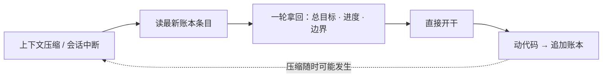
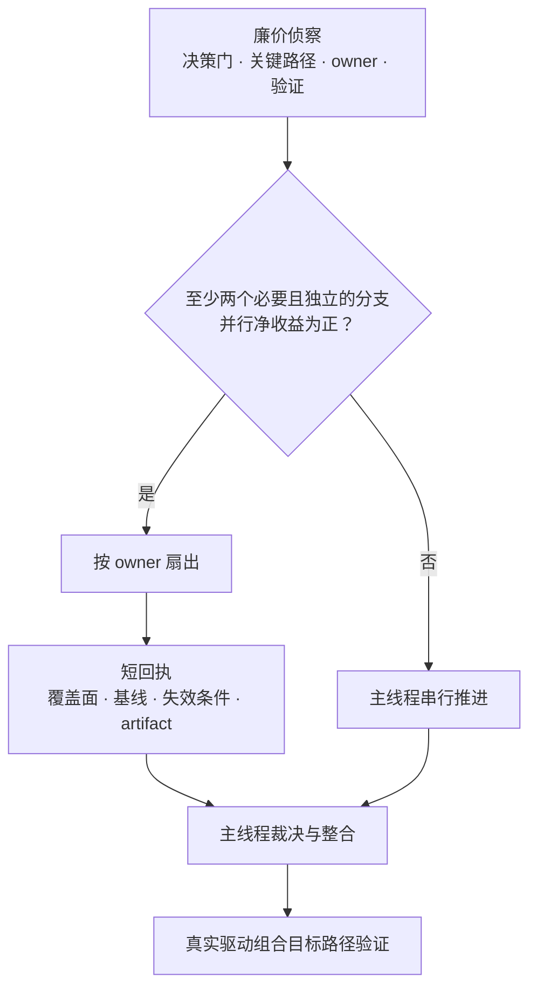

# ⚒️ Forged in Production

**与 AI 长期协作的工程方法论 —— 每条规则背后，都是一次真实事故**

**中文** | [English](README.en.md)


> 市面上的「AI 编程最佳实践」大多是设计出来的。
>
> 这一份是**打出来的**：来自一个有真实付费用户、真实资金流水的生产系统，在与 AI Agent 数月的深度协作中，用返工、宕机和真金白银换来的规则集。
>
> **本仓库里的每一条规则，都能指向一次具体的翻车。指不出来的，已经被删了。**

---

## 你是否撞过这六堵墙

只要你让 AI（Claude Code / Codex / Cursor / …）深度参与一个**真实项目**而不是写 demo，这些墙迟早撞上：

| | 症状 |
|---|---|
| 🧠 **失忆** | 上下文一压缩，AI 花半小时「重新熟悉项目」，把昨天已验证的结论再排查一遍 |
| 🗿 **决策失传** | 三周前「为什么选 A 不选 B」没人说得清，翻聊天记录翻到怀疑人生 |
| ✅ **假绿灯** | AI 汇报「测试全部通过」——实际没跑，或者跑的根本不是目标场景 |
| 🔁 **月经坑** | 同一个坑，每个月换个马甲再踩一次 |
| 💥 **互相践踏** | 多个 agent 并行改代码，彼此覆盖改动，`git add -A` 混入别人的半成品 |
| 🏗️ **过度工程** | 一句话的小需求，被 AI 做成带独立页面、五个配置项、三层抽象的「平台」 |

六堵墙，六个模式。**每个模式都先讲事故，再讲规则**——因为顺序反了你就不会信。

---

## 模式一：唯一任务账本 —— 只记两件事

### 事故现场

一次长任务在上下文压缩后，AI 把前一天已经用生产数据验证过的结论当成未知问题，从头排查了一遍。烧掉的不是 token，是一整个下午。更糟的版本：它重查后得出了**不一样的结论**，把已经修好的东西又「修」了一遍。

### 规则

项目里维护**唯一一份任务账本**（一个 `WORKLOG.md`），核心只记两件事：

1. **总目标**——这轮工作最终要交付什么
2. **干到哪了**——含**验证证据**（跑了什么命令、看到什么输出）和**下一步**

配套纪律：

- **动代码必记**，不动代码不记——账本不是日记
- 压缩或会话中断后，**一轮之内**从最新账本条目拿回总目标、进度和边界，直接开干；**不重查已验证的事实，不重读旧材料**
- 禁止平行账本。第二份「进度文档」出现之日，就是两份都不可信之时



### 为什么有效

账本不是写给审计的，是**写给下一个失忆的自己**的。判断一条账本记录合不合格只有一个标准：一个完全没有上下文的 agent，能否只凭这条记录接着干活。「验证证据」字段是灵魂——没有它，「已完成」三个字毫无信息量（见模式四）。

📄 模板：[templates/worklog-template.md](templates/worklog-template.md)

---

## 模式二：链条口径文档 —— 决策链每任务一行

### 事故现场

一条横跨十几个任务的长期工作线，推进到一半需要确认「当初为什么放弃方案 B」。答案散落在三周前的聊天记录、某次 commit message 和一个已经压缩掉的上下文里。找回这个答案的成本，比重新做一次决策还高——于是决策被重做了一次，**而且做反了**。

### 规则

每条**跨任务的长期工作线**，维护一份「链条口径」文档，固定三节：

1. **当前口径**——此刻生效的结论、边界、约束（永远保持最新，被新决策覆盖就地改写）
2. **决策链**——每个任务一行：日期、决定了什么、为什么。**只追加，不修改**
3. **未决项**——挂着的问题，附「谁/什么条件能解决」

配套纪律：

- 触及某条线的范围前，**先读该线的链档**核对不冲突
- 口径变化时，在**同一个任务里**完成两个动作：改写「当前口径」+ 追加决策链一行
- 细节证据留在任务账本，链档**只保持口径**——它是索引和裁决，不是仓库

### 为什么有效

账本按时间流动，链档按主题沉淀，二者分工明确：「上周干了什么」查账本，「这条线现在的口径是什么、怎么走到今天的」查链档。决策链「每任务一行」的克制是关键——一行写不下的细节本来就不属于这里。

📄 模板：[templates/chain-doc-template.md](templates/chain-doc-template.md)

---

## 模式三：记忆 = 根因 + 坑 + 杠杆

### 事故现场

同一类客诉第二次进来。第一次排查花了一下午，走了三条岔路；第二次照着第一次沉淀的 playbook，**五分钟定位到同一根因**。差别不在 AI 变聪明了，在于第一次的教训被压缩成了「症状 → 判读 → 动作」三行，而不是一篇复盘散文。

### 规则

跨会话记忆按「**一条记忆 = 一个文件 = 一个事实**」组织，索引里每条只有一行 hook。核心是**写法公式**：

> **一条合格的记忆 = 根因 + 坑 + 杠杆**

- **根因**：判读公式或结论本身（例：「命中率 = 缓存读 / (输入 + 缓存读)，不是缓存读 / 输入」）
- **坑**：这次浪费了时间的岔路，下次要绕开的（例：「X 日志时区是 CEST 不是 UTC，直接对时间会差俩小时」）
- **杠杆**：下次遇到同类问题的**最快入口**（例：「先查 Y 表的 Z 字段，5 分钟内分流三种根因」）

反模式对照：

| ❌ 不要记 | ✅ 要记 |
|---|---|
| 「修复了缓存命中率问题」（git 历史都有） | 「命中率的正确算法是 X，误算成 Y 会虚高 5 个点」 |
| 「排查了很久最终解决」 | 「同类症状先看 A 再看 B，第三种可能是 C」 |
| 「这个功能已上线」 | 「上线后回滚的唯一开关是 X，改配置不重启即生效」 |
| 复盘全文 | 三行 playbook：症状 → 判读 → 动作 |

### 为什么有效

记忆的读者是「未来某个带着同类问题进来的会话」，它只有几秒钟决定这条记忆有没有用——所以价值必须压进标题行。事故排查类记忆直接写成 playbook，是整套体系里**复利最高**的一件事：第一次的下午换来之后每次的五分钟。

📄 模板：[templates/memory-template.md](templates/memory-template.md)

---

## 模式四：风险分级验证阶梯 —— 编译通过 ≠ 验收

### 事故现场

事故一：修一条计费路径，类型检查全绿、单测全绿，合入。真实请求打进来才发现——**目标分支根本没被触发过**，绿灯照的全是旁边的路。

事故二：子 agent 汇报「全部测试通过」。人工复跑发现测试确实通过了——因为它跑的是**另一个目录的旧代码**。

### 规则

验证强度不由心情决定，由**风险等级**决定：

| 等级 | 典型改动 | 最低验证要求 |
|---|---|---|
| 🟢 低 | 文案、样式、纯展示 | 静态检查 + 类型/构建 + 目标处冒烟 |
| 🟡 中 | 业务逻辑、接口、开关 | 单测/集成 **+ 隔离运行实例里实际触发目标路径** + 功能开/关两态都过 |
| 🔴 高 | 钱、权限、迁移、生产切流 | 中风险全部 **+ 金额、幂等、权限、迁移、补偿、回退的逐项证明** + 等价环境验收 |

三条铁律：

1. **编译或单测通过 ≠ 目标场景验收。** 绿灯只证明你照亮的地方没问题，不证明你照对了地方
2. **不信任何 agent 自报的绿灯。** 验收动作发生在主线程，或由主线程独立复跑；证据（命令 + 关键输出）进账本
3. **高风险任务，回退方案先于上线方案存在。** 说不出怎么回退，就还没准备好上线

### 为什么有效

AI 汇报成功的置信度和实际成功的概率之间没有可靠关联——它不是在撒谎，是它对「通过」的定义常常和你不一样（跑了 ≠ 跑对了目录；通过 ≠ 触发了目标路径）。阶梯把「验证到什么程度算够」从每次现场争论，变成查表。

📄 模板：[templates/verification-ladder.md](templates/verification-ladder.md)

---

## 模式五：多 Agent 纪律 —— 按门扇出，按证据收口

### 事故现场

事故一：两个 agent 在同一棵工作树上并行改代码——A 的自测因为 B 的半成品而失真，B 提交时 `git add -A` 把 A 未完成的改动一起打包进了历史。

事故二：十几个并发 agent 线程把一台 20 核 32GB 的工作站**直接打到死机**，重启后编排器自动恢复线程，又冻一次。

事故三：让同一个模型开三路「独立交叉验证」，收回来三份措辞不同的**同一个偏见**——多数投票给了错误答案更高的置信度。

事故四：十路 agent 各自返回一大坨过程和结论，主线程为了看懂它们耗尽上下文，又把十路检查逐一重跑。并行省下的时间，全在汇总和重复核验里还了回去。

### 规则

- **先廉价侦察，再决定扇不扇。** 侦察只产出当前阶段的验收/决策门、关键路径、写 owner、必要分支和验证路径；它负责路由，不代替充分调研
- **只有关闭当前决策门所必需的分支才扇出。** 前置必须稳定、可并行、写目标不冲突、能独立验证，而且节省的墙钟时间足以覆盖派发、汇总、消费和核验成本；否则串行或延后
- **调查优先并行，实现默认单写手。** 搜证、盘点、交叉核验天然适合只读扇出；确需并行写时，每个写目标只能有一个 owner，并用独立 worktree 物理隔离
- **要并行写，就物理隔离。** 每个子任务一棵独立 worktree，完成后 cherry-pick 合入；必须动同一批文件的子任务，放同一棵树**顺序**跑
- **详细证据落临时 artifact，主线程只收结构化短回执。** 回执必须带：结论、对应决策门、基线身份、证据覆盖面、artifact 路径、失效条件、是否现在需要主线程；默认不读正文，只有影响当前决策、高风险、冲突、抽查失败或回执不足时才打开
- **覆盖面必须明说。** 「在已查 3 个里成立」不能冒充「全部 N 个都成立」；正向存在性可定点核验，否定/完备性结论必须给搜索范围、分母、排除项和穷尽/抽样声明
- **子分支绿不等于整合绿。** 每路跑目标检查并留下可复核入口；合并后主线程必须真实驱动组合目标路径做一次权威验证，不能把 N 份自报绿再汇总一遍当验收
- **共享树上永不 `git add -A` / `git add .`。** 只用 `git commit --only -- <精确文件>` 提交本轮目标文件，提交后 `git show --stat` 核验没混入别人的改动
- **同模型多路 ≈ 复读机。** 多 agent 的价值不在投票，在于**按证据裁决**——让每路带不同的证据切片和审视角度，最后由主线程看证据下结论，而不是数票
- **并发要有总闸。** 资源上限（线程数、内存）是显式配置，不是「应该没事」
- **敏感/活跃区的代码，登记规格而非并行莽改。** 一段代码在别的 agent 正活跃改的共享树里、又是敏感门禁（钱、迁移、权限），即使你有权改，也该把精确实现规格交给负责那块的 agent、让它走自己的验证闭环——你并行改会撞共享树冲突，还绕过了它该跑的验证。能外包的是判断的执行，不是判断本身



### 为什么有效

调查是幂等的、无副作用的，天然适合并行；实现有状态、有顺序依赖，只有物理隔离且净收益为正时并行才划算。短回执把主线程成本从「重读全部过程」降为「先分诊、命中才深挖」，但不会取消整合验证。「不信子 agent 自报绿」（模式四）和「主线程裁决」是同一枚硬币的两面：**你可以外包劳动，不能外包判断。**

📄 模板：[templates/agent-receipt-template.md](templates/agent-receipt-template.md)

---

## 模式六：反过度工程写进硬规则

### 事故现场

一个「在现有页面加个按钮」级别的需求，产出物是：独立路由页面、四个热配置项、一层「以后可能用」的抽象、默认关闭「等待后续配置」。看起来更「完备」，实际上是把一次性的决策成本，转嫁成了永久的维护成本——那四个配置项从上线到最后被删掉，**一次都没被改过**。

### 规则

把反过度工程从「品味」升格为**硬边界**，写进 agent 每次都会读的规则文件：

> **调研必须充分、证据必须完整、验证必须严格；最终实现必须采用满足需求的最简单可靠方法。** 精简约束的是实现，不是把调查做浅、证据做残或验证做弱。

- 功能按需求**最小闭环**落地：优先就地动作、默认可用、复用现有机制和页面
- 不为小功能新建独立页面、平行基建、投机性抽象
- **动手造之前先找现成的。** 要加新机制/新特例前，先在代码库里搜有没有既定机制解决同类问题——**最好的优化经常是发现轮子已经有了**，用对现成的比造第二个轮子更安全（尤其别在敏感门禁上加特例逻辑）
- **不预留**「以后可能用」的开关、字段、接口、表结构
- 可配置面最小化：只有真实业务/运维需要变的值才做成配置，其余写常量
- **精简类任务的产出本身必须精简**——用三页文档论证「怎么删代码」是行为艺术

### 为什么有效

AI 天然倾向过度工程，因为「更完整」在它的视角里更安全——多一个配置项、多一层抽象，看起来都是在「为你着想」。品味顶不住这个倾向，只有写成硬规则、每次开工都在上下文里，才顶得住。

---

## 元教训：这套体系砍过自己两刀

诚实环节。这套体系自己也过度工程过，砍掉的过程同样是规则的来源：

**第一刀：** 曾把「双模型交叉复核」hook 挂在每次 commit 的主链上。听起来很稳，实际是给每次提交加了一笔固定税，而绝大多数提交根本不值得两个模型看。后来退成 opt-in——只有主动要求的仓库才启用。

**第二刀：** 曾用 30+ agent 的编排工作流去回答一个「我们的流程是不是太复杂了」的问题。是的，用最复杂的方式回答「是否太复杂」。被当场叫停，换成读三个关键小文件、给一页纸结论。

由此得出**规则的规则**，也是整个仓库的元规则：

> 1. **只写违反了会疼的规则。** 每条规则必须能指向一次真实事故；指不出来，删掉
> 2. **流程重量跟风险走，不跟仪式感走。** 碰钱碰生产的任务配重流程，改文案的任务不配
> 3. **规则只有一个事实源。** 其他地方只引用，不复制——复制出去的规则必然腐烂
> 4. **体系要能砍自己。** 长出来的每一层流程，默认有罪，直到证明它挡住过事故

---

## 快速开始

不想读完全文？一条命令装好整套（规则 + hook + 账本 + 待裁决冒泡），幂等、不覆盖你已有配置：

```sh
curl -fsSL https://raw.githubusercontent.com/SPHINX998/forged-in-prod/main/starter/install.sh | sh    # Mac/Linux/WSL/Git-Bash
```
```powershell
iwr -useb https://raw.githubusercontent.com/SPHINX998/forged-in-prod/main/starter/install.ps1 | iex   # Windows PowerShell
```

细节、手动装法、卸载见 [`starter/`](starter/)。**这是「工作日志怎么自动生成」的真实答案**——不是魔法，是「规则常驻 + hook 兜底 + 恢复读回」。

## 渐进采纳路线

不要一次全上。这套体系是长出来的，你的也应该是：

| 时机 | 动作 |
|---|---|
| **第 1 天** | 只上任务账本：一个 markdown 文件，两个字段（总目标 / 干到哪了+证据） |
| **第一次踩坑** | 写第一条 playbook 记忆：根因 + 坑 + 杠杆，三行 |
| **第一条跨任务工作线** | 开第一份链档：当前口径 / 决策链 / 未决项 |
| **第一次多 agent 并行** | 实现留主线程，扇出只做调查；要并行写就独立 worktree |
| **第一次碰钱/碰生产** | 上验证阶梯🔴档；回退方案先于上线方案 |

---

## FAQ

**Q：这不就是「写好文档」吗？**
不是。服务对象不同：文档写给人类新人，这套东西写给**下一个失忆的 AI**。所以它格式极度压缩（一行 hook、三行 playbook）、入口极度固定（最新账本条目、链档三节、记忆索引），并假设读者必须在一轮对话内完成恢复。人类文档没有这些约束，也就不会长成这个形状。

**Q：适用什么工具？**
与工具无关。Claude Code、Codex、Cursor、Aider，任何能读写文件的 agent。整套体系 = markdown + 纪律，零依赖。

**Q：会不会太重？**
见「规则的规则」第 4 条。这套体系砍过自己两刀，砍的记录就在上面。如果某条规则在你的项目里指不出对应的事故——那它对你就是仪式，删掉。

---

## 贡献

欢迎把**你的事故**变成规则。PR 格式硬性要求：

> **事故现场 →  规则 → 为什么有效**

没有事故现场的规则不收——本仓库不收设计出来的规则，只收打出来的。

---

*本方法论在真实生产系统的日常 AI 协作中持续锤炼，仍在挨打，仍在更新。*
